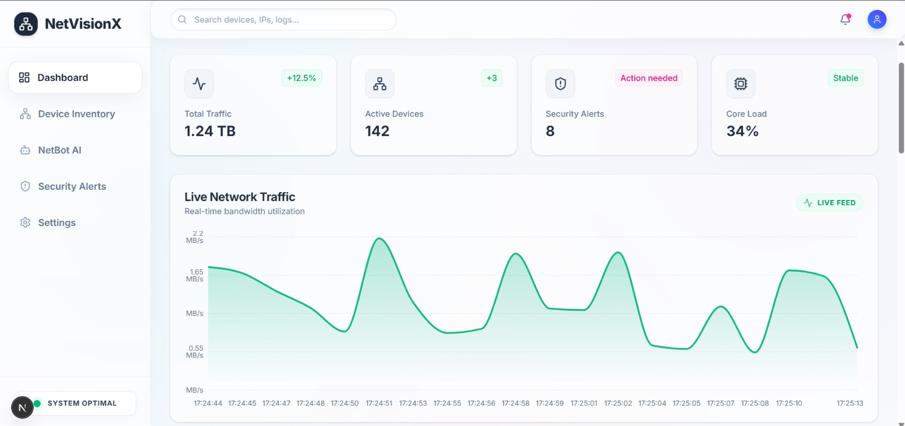
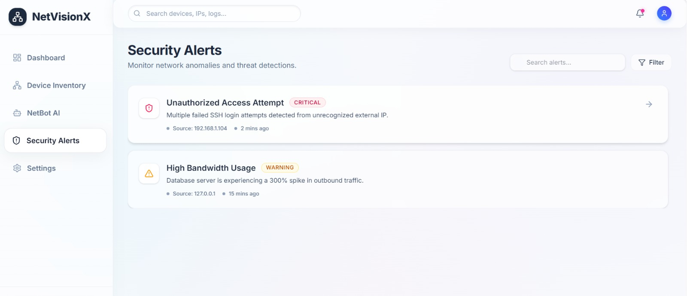
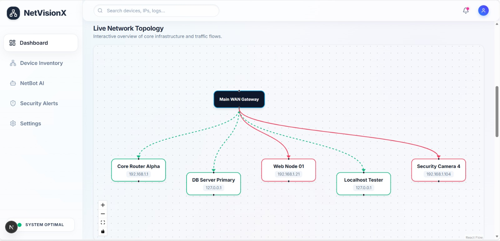
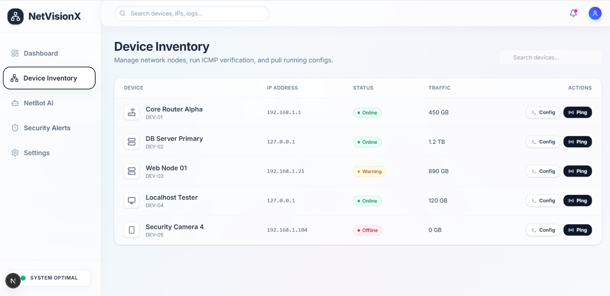
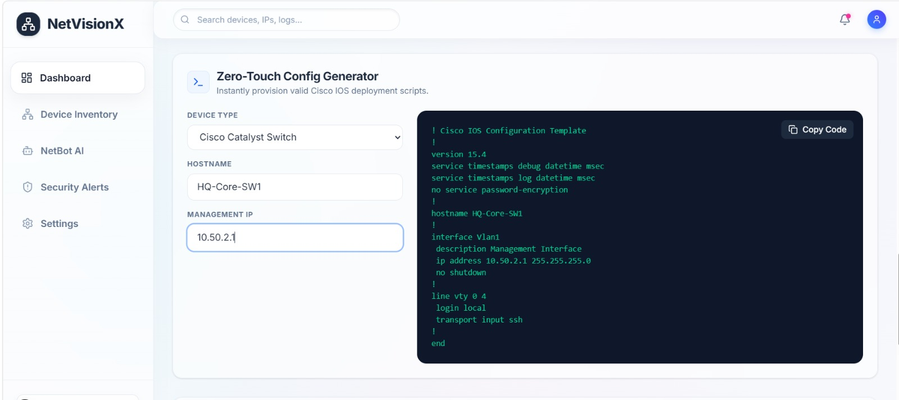
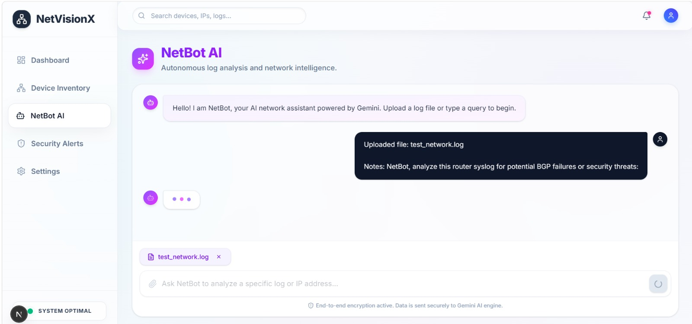
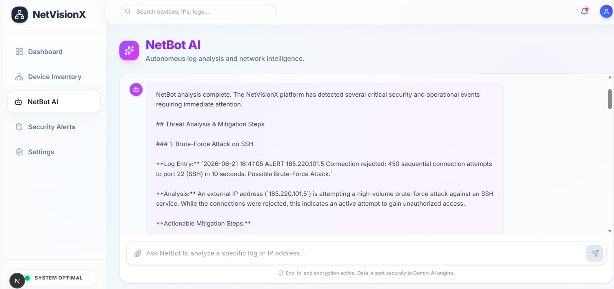
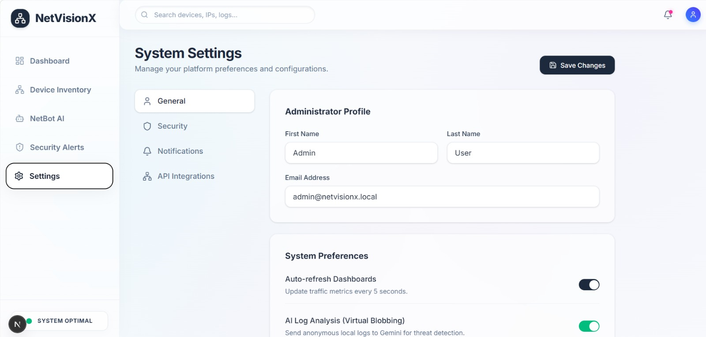

# 🌐 NetVisionX: Enterprise Network Controller & AI Diagnostics



> **NetVisionX** is a full-stack, real-time network telemetry and automation platform designed to bridge the gap between traditional network engineering and modern AI-driven NetDevOps.

---

## 📌 Executive Summary
Modern network operations require split-second visibility, rapid configuration, and intelligent anomaly detection. NetVisionX solves this by providing a unified, "Liquid Glass" dashboard that streams live bandwidth telemetry, maps network topology dynamically, automates Zero-Touch Provisioning (ZTP) for Cisco hardware, and integrates a custom **Google Gemini 2.5 LLM** to diagnose raw system logs autonomously.

---

## 🚀 Visual Showcase & Core Capabilities

### 1. Live Telemetry Engine (WebSockets)
Bypasses standard HTTP polling to stream real-time machine network I/O data directly to the Next.js frontend using `psutil` and FastAPI WebSockets.


### 2. Proactive Security Alerts & Status Monitoring
Real-time monitoring of network thresholds, CPU loads, and active security threats with visual glassmorphism indicators.


### 3. Dynamic Topology Mapping
Visualizes active nodes, gateways, and routing infrastructure using React Flow. Data is hydrated dynamically from a live PostgreSQL database.


### 4. Graph-Based Device Inventory
Live tracking of network hardware status, IP routing, and traffic loads, replacing static spreadsheets with interactive UI elements.


### 5. Zero-Touch Provisioning (ZTP) Engine
An automated Cisco IOS configuration generator for rapid, error-free router and Catalyst switch deployments. Generates deployment-ready CLI code based on UI parameters.


### 6. NetBot AI Diagnostics (Google Gemini Integration)
An integrated LLM pipeline that ingests raw network telemetry (Syslog, SNMP traps, BGP neighbor drops, Duplex mismatches) and outputs actionable, plain-English mitigation steps.
*Input: Raw Syslog Data*

*Output: AI-Generated Mitigation Strategy*


### 7. Administrative Settings & Platform Configuration
Built with a modular architecture to support future expansions like advanced Role-Based Access Control (RBAC) and Webhook integrations.


> 🎥 **Demo Video:** Check out `assets/herovideo.mp4` in the repository for a live 60-second walkthrough of the WebSocket telemetry and AI analysis in action!

---

## 🏗️ System Architecture & Technology Stack

### **Frontend Architecture**
* **Framework:** Next.js 14 (React) with App Router
* **Styling:** Tailwind CSS (Custom Glassmorphism UI)
* **Data Visualization:** Recharts (Time-series bandwidth data)
* **Graphing:** React Flow (Node-based network topology)
* **Icons:** Lucide React

### **Backend Engine**
* **Framework:** FastAPI (Python) running on Uvicorn ASGI server
* **AI Engine:** Google GenAI SDK (Gemini 2.5 Flash model)
* **Hardware Metrics:** `psutil` for cross-platform network interface tracking
* **Security Subsystem:** PyJWT and Passlib (bcrypt) for secure token generation

### **Database & Infrastructure**
* **Database:** PostgreSQL
* **ORM:** SQLAlchemy (Declarative mapping)
* **Containerization:** Docker & Docker Compose for isolated DB environments

---

## ⚙️ Local Deployment Guide

Follow these steps to launch the NetVisionX environment locally:

### Prerequisites
* Docker Desktop
* Node.js (v18+)
* Python (3.10+)

### 1. Database Initialization
Ensure Docker is running, then spin up the PostgreSQL container from the root directory:
```bash
docker-compose -f docker-compose.db.yml up -d
